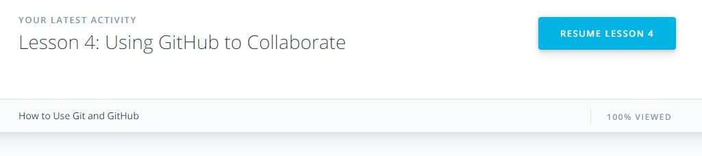
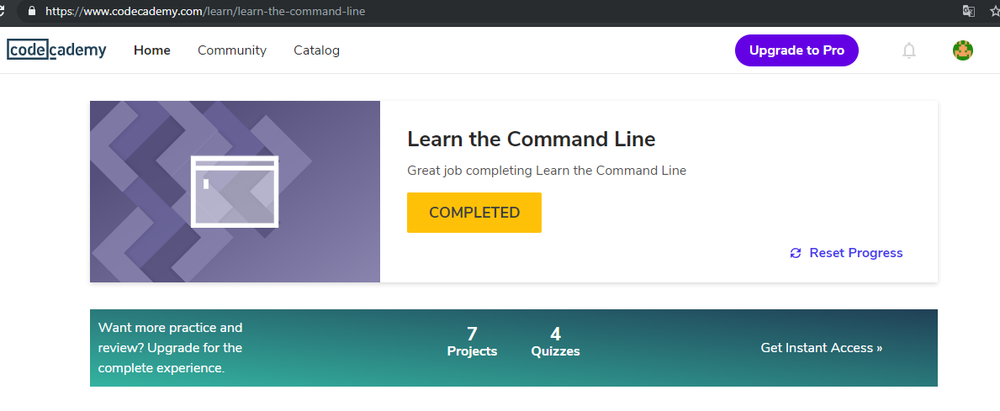

# kottans-frontend

Mome, look, I'm finished the first chapter aducation with Kottans!

-------------------------------------------------------------------------
## Linux CLI, and HTTP

Look there! Another one completed! Thanks you, [Kottans](https://github.com/kottans)!