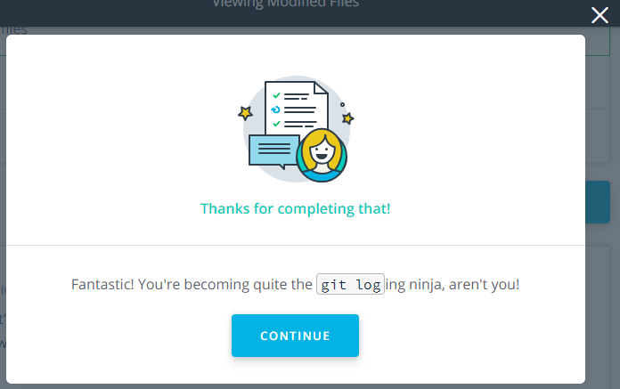
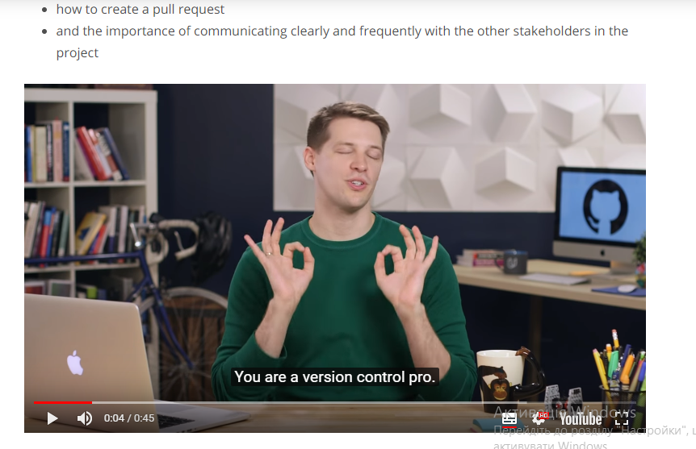
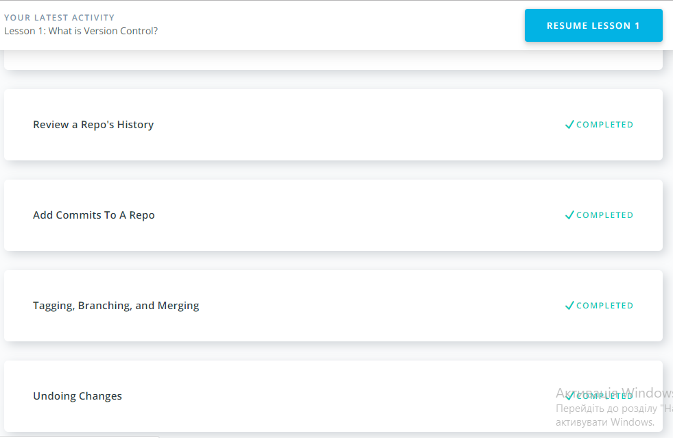
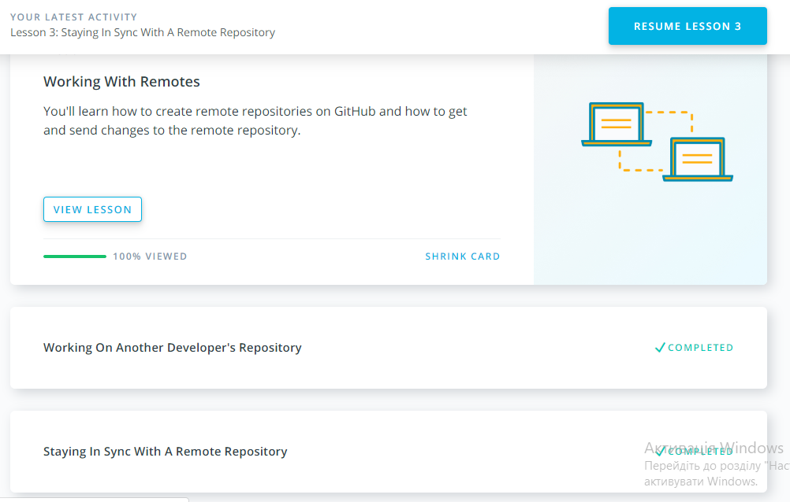
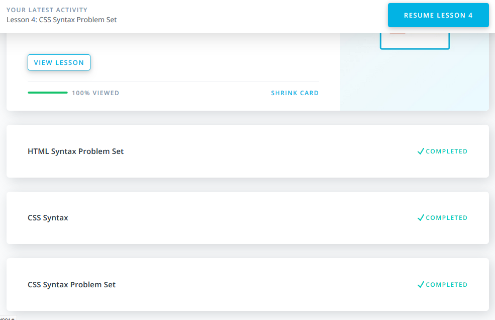
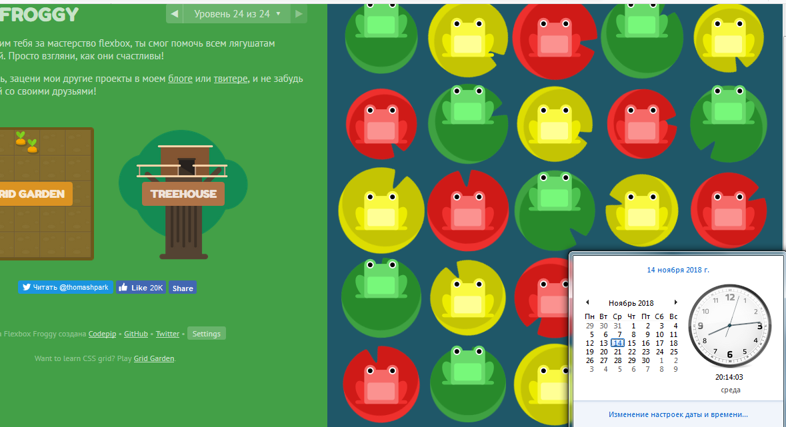
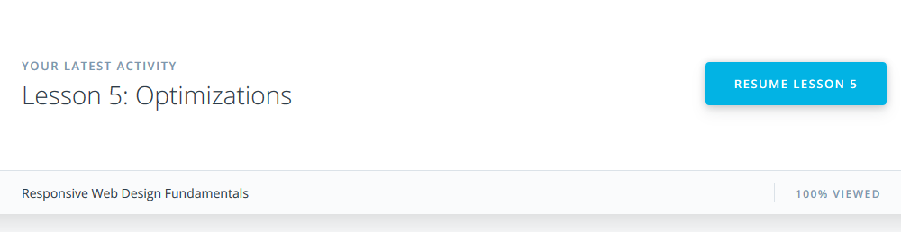

# kottans-frontend

Mome, look, I'm finished the first chapter aducation with Kottans!

-------------------------------------------------------------------------
## Linux CLI, and HTTP

Look there! Another one completed! Thanks you, [Kottans](https://github.com/kottans)!

## Git Collaboration

BRUTAL

SAVAGE

RECT

-------------------------------------------------------------------------

## Intro to HTML and CSS

In this chapter I did not learn anything new, but I repeated and consolidated a lot of old information. Once again, grateful for organizing a wonderful course!

## Responsive Web Design

In this lesson no one frog hurts!

In this great lesson I learned basics of Responsive Web Design and try to use it in practice.
It seems looks not bad.
https://codepen.io/krash1408/pen/dQvmjE

Let's try next!